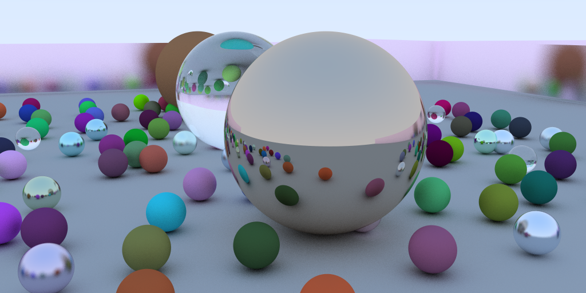
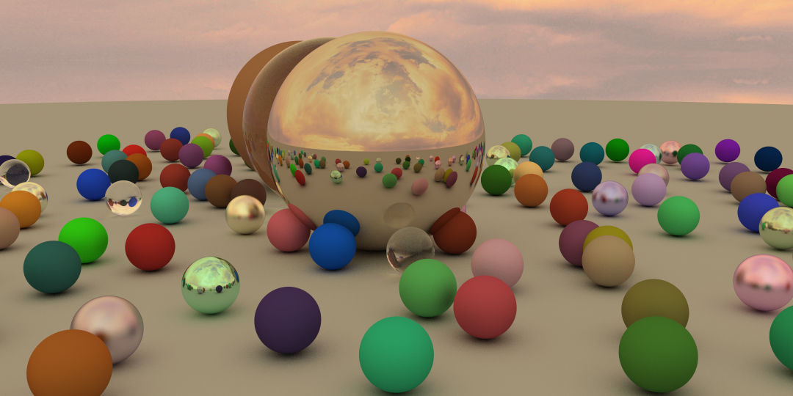

`raytracer_in_a_weekend` is my attempt at making a ray-tracer while following along the excellent _Ray Tracing in One Weekend_ guide. It also served as a good mini-project to brush up my Rust skills.

The provided demo (in [random.rs](src/bin/random.rs)) renders a randomly generated scene. The scene consists of a collection of spheres with one of 3 types of materials:

- Lambertian (matte)
- Metal
- Dielectric (glass)

## My additions

These things weren't covered in _Ray Tracing in One Weekend_ but I added them anyway ¯\\\_(ツ)\_/¯:
* Multi-threading using [`rayon`](https://crates.io/crates/rayon)
* Planes
* Textures: images (PNG and JPEG) and linear gradients
* Scene serialization/deserialization via JSON files

## Running

1. Ensure you've setup `cargo` properly.
2. `cd` to the project's root directory.
3. There are 2 binaries:
    - `random`
        - Renders a randomized scene full of spheres
        - Run by doing `cargo run --release --bin random`
    - `custom`
        - Renders a scene by reading its description from a JSON file
        - Run by doing `cargo run --release --bin custom -- --scene inputs/scene.json`

    Both binaries also take ray tracing parameters via CLI arguments. You can view them by doing `cargo run --release --bin <binary-name> -- -h`
    
    NOTE: Rendering is CPU intensive. To speed things up, `rayon` will try to use as many CPU cores as possible. A progress bar will be shown to ensure that you're not left waiting blindly.
4. The rendered scene will be saved as `scene.png` (or whatever path you specified in the optional `output` CLI argument).
